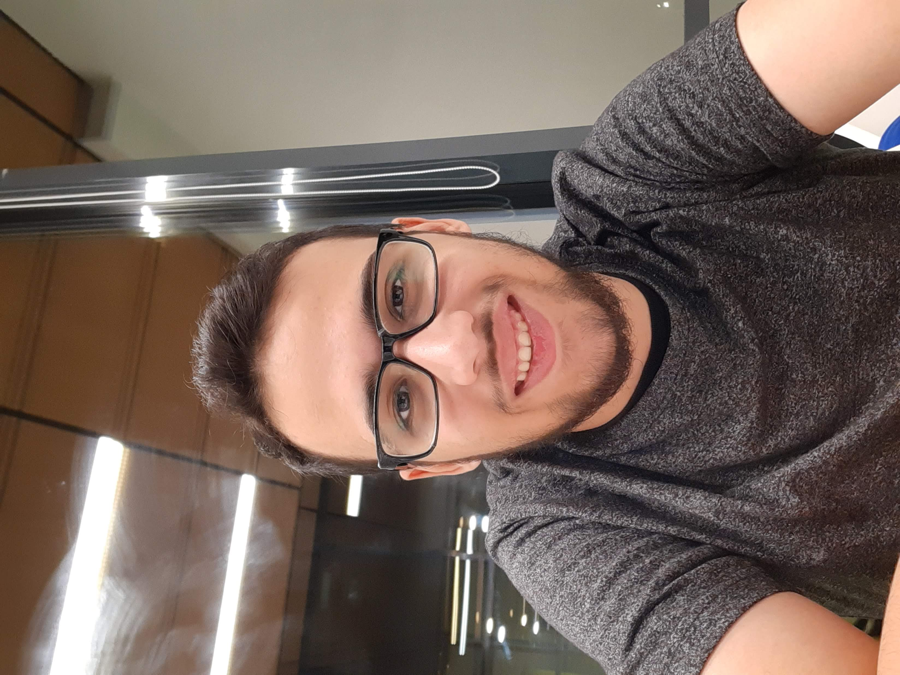

## About Me

<!--  -->

**Hello!** My name is Hany Hamed. I am a 1st-year Master of Science in Robotics at [KAIST](https://www.kaist.ac.kr/en/).

<!-- 4th-year Computer Science (Robotics track) bachelor student at [Innopolis University](https://innopolis.university/en/). -->

Originally, I am from Egypt 🇪🇬 and currently I am located in Daejeon, South Korea. In 2022, I have finished my Bachelor in Computer Science with a specialization in robotics from Innopolis University.

<!-- (https://innopolis.com/en/) to study my bachelor degree. -->

<!-- &nbsp; &nbsp; CV: [PDF](https://drive.google.com/file/d/1jCVdzSeKpFmIbUnwPJ15etRjJpP82kGy/view?usp=sharing) -->

&nbsp; &nbsp; GitHub: [@hany606](https://github.com/hany606)

&nbsp; &nbsp; Google Scholar: [Hany Hamed](https://scholar.google.com/citations?user=J5ogYwsAAAAJ&hl=en)

&nbsp; &nbsp; LinkedIn: [LinkedIn](https://www.linkedin.com/in/hany-hamed-elanwar/)

## News:

- **August 2022:** Joined VDC lab
- **July 2022:** Graduated with Bachelor in Computer Science (Robotics track), Innopolis University.
- **April 2022:** Got accepted in Automation and Electrical Engineering, Master of Science (Technology) (2 yrs) Aalto University, School of Electrical Engineering.
- **Feburary 2022:** Got accepted to attend "2022 IEEE RAS Summer School on Multi-Robot Systems in Prague"
- **Feburuary 2022:** Got accepted in M.S. in Robotics  at KAIST
- **January 2022:** "Optimization-based Trajectory Tracking Approach for Multi-rotor Aerial Vehicles  in  Unknown  Environments" got accepted in RA-L (Second Author)
- **December 2021:** Got accepted in Master of Science programme in ’Master Systems and
Control’ from University of Twente.

**Disclaimer: of course many failures, bad news and rejections happened during these wonderful news, however, I am determined to overcome these failures inshallah**

## Research Interest
At the current moment, I am interested in:
* Motion planning of self-driving cars.
* Robot learning (Reinforcement Learning, Evolutionary Algorithms, ...etc)
* Multi-robotic system
* Sim2Real

Starting from August 2022, I am a member of the "Decision & Motion Planning" team in [VDC lab](http://vdclab.kaist.ac.kr/) under the supervision of Prof. [Dongsuk Kum](http://vdclab.kaist.ac.kr/bbs/board.php?bo_table=sub1_1). 

Therefore, at the moment, I am interested in developing motion planning algorithms based on learning approaches specifically Reinforcement Learning. I am willing to explore and work on the intersection between Multi-Agent Reinforcement Learning (MARL) and motion planning for Autonomous Vehicles. I am excited to research and work on how MARL can be used in autonomous vehicles and the self-driving cars research field to extend the current state-of-the-art.

<!-- I am interested in developing a system of multiple robots that are able to learn some behaviors in order to perform some tasks using learning-based methods, moroever, I am interested in transfering the learnt policy for the robots to the real world.

I am curious to find out how far these kind of systems will learn the behavior like humans and creating different stratigies and behaviors. -->

During my bachelor's, I explored, implemented, and used self-play reinforcement learning to enable agents in a predator-prey environment to learn intelligent behaviors while partially observing the environment ([Link](https://hany606.github.io/selfplay_predprey)). I had explored my passion in researching how to develop multiple intelligent robots in a system that can learn some interesting behaviors to perform some tasks using learning-based methods such as MARL. Furthermore, I am interested in transfering the learnt policy for real robots in the real world.

## Publications

1. **Optimization-based Trajectory Tracking Approach for Multi-rotor Aerial Vehicles  in  Unknown  Environments**

    G. Kulathunga, **H. Hamed**, D. Devitt and A. Klimchik
    
    IEEE Robotics and Automation Letters, 2022

    ([paper](https://ieeexplore.ieee.org/abstract/document/9713695))

    <u>Participated in debugging, conducting, and piloting real-world experiments.</u>

2. **Learning stabilizing control policies for a tensegrity hopper with augmented random search**
 
    V. Kurenkov, **H. Hamed**, and S. Savin
    
    2020 International Conference on Industrial Engineering, Applications and Manufacturing (ICIEAM) 

    ([code](https://github.com/hany606/tensegrity-vertical-stability), [paper](https://arxiv.org/abs/2004.02641))

    <u>Participated in developing and conducting the RL experiments and developing the simulation and training scripts</u>

<!-- 3. **Analysis of algorithms for controlling the length of crawling robot modules**

    L. Vorochaeva, S. Savin, **H. Hamed**, and A. M. Leon

    2020 4th Scientific School on Dynamics of Complex Networks and their Application in Intellectual Robotics (DCNAIR)
    
    ([paper](https://ieeexplore.ieee.org/abstract/document/9216734)) -->

1. **Lateral gait analysis of a crawling robot by means of controlling the lengths of links and friction in the supports**

    L. Vorochaeva, S. Savin, and **H. Hamed**
    
    2020 International Conference Nonlinearity, Information and Robotics (NIR)
    
    ([paper](https://ieeexplore.ieee.org/abstract/document/9290216))

    <u>Participated in proofreading, literature review, and writing a section.</u>

<!-- 5. **Differentiable Tensegrity Simulator with Sim2Real Experiments**

    **H. Hamed***, V. Kurenkov* and S. Savin
    
    [Manuscripts to be submitted in Learning for Dynamics and Control Conference (L4DC) 2022]

6. **A Brief Survey on Locomotion Control Methods For Crawling Robots**

    **H. Hamed**, S. Savin and L. Vorochaeva
    
    [Manuscripts to be submitted in Nonlinearity, Information and Robotics (NIR) 2022] -->

<!-- ## Typography

This is a [link](http://google.com). Something *italics* and something **bold**.

Here is a table

Year | Award | Category
-----|-------|--------
2014 | Emmy  | Won Outstanding Lead Actor in a miniseries or a movie
2015 | BAFTA | Nominated for Best Leading Actor for Sherlock
2014 | Satellite | Won Best Actor miniseries or television film

Here is a horizontal rule

---

Here is a blockquote

> To a great mind, nothing is little -->

## References
* [Dr. Stefano Nolfi](mailto:stefano.nolfi@istc.cnr.it): Research Director, National Research Council

* [Dr. Alexandr Klimchik](mailto:a.klimchik@innopolis.ru): Director of Robotics and Computer Vision Institute, Head of Master and Bachelor on Robotics program and Associate Professor, Innopolis University.

* [Prof. Sergei Savin](mailto:s.savin@innopolis.ru): Senior Researcher at Center for Technologies in Robotics and Mechatronics Components, Innopolis University

* [Prof. Igor Gaponov](mailto:i.gaponov@innopolis.ru): Head of Lab of Intelligent Robotics Systems, Innopolis University

