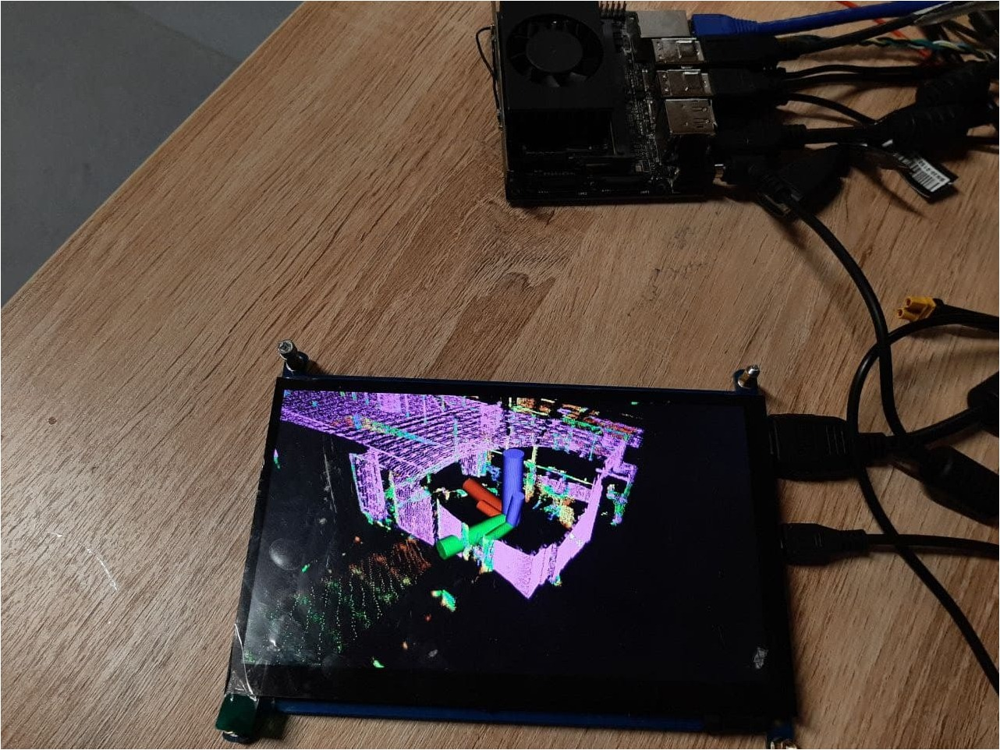
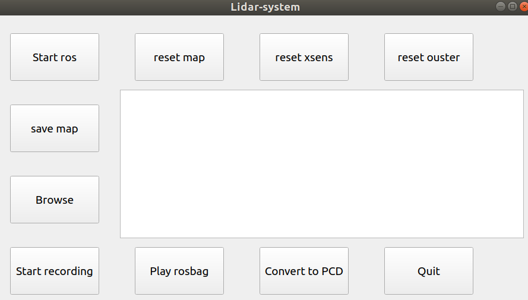

# Handheld Lidar

This device was used to scan Innopolis city, the below video shows the results of the device
<iframe width="420" height="315" src="http://www.youtube.com/embed/0-JlWdAJvh8" frameborder="0" allowfullscreen> </iframe>

This device was made for an industrial partner. We have used ROS, Velodyne lidar and Jetson xavier with touch screen for the user.

Also, I created a simple gui to easily used the system (This gui has been done without UI specialist, so it can be improved).

### Note: 

Unfortunately, this project is closed source, thus extra information about the system is not available to share. I am only sharing the results of the work without detailed information about the system.

## Acknowledgement
The project has been done by me with Devitt Dmitry (The team leader) in Drones group at Unmanned Technology Lab, Innopolis University, Russia
